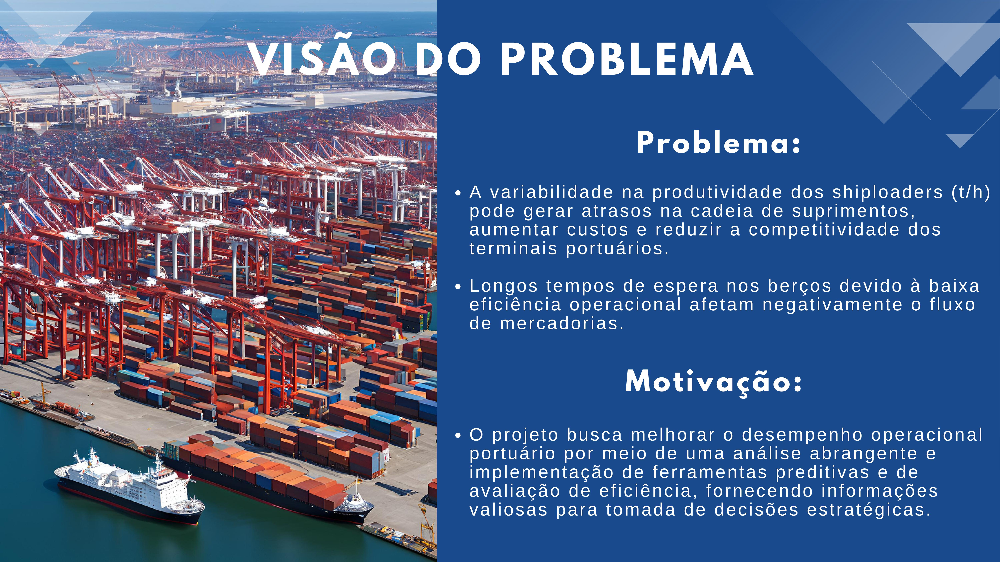

# ANÁLISE DO SISTEMA PORTUÁRIO E PROJEÇÃO DA PRODUTIVIDADE DOS SHIPLOADERS

> Este projeto visa otimizar a operação de terminais portuários através da análise de dados históricos e do desenvolvimento de modelos preditivos, trazendo insights críticos para a eficiência dos processos e competitividade dos portos.

 
API 4° Semestre - Logística Noturno

 
  

   
 
 

## Sumário

:small_blue_diamond: [Aprendizado por Projeto Integrado (API)](#aprendizado-por-projeto-integrado-api)  
:small_blue_diamond: [Equipe](#equipe)  
:small_blue_diamond: [Descrição do Projeto](#descrição-do-projeto)  
:small_blue_diamond: [Backlog do Produto](#backlog-do-produto)  
:small_blue_diamond: [Organização e Metodologia](#organização-e-metodologia)  
:small_blue_diamond: [Resultado e Produto](#resultado-e-produto)  
:small_blue_diamond: [Tecnologias Utilizadas](#tecnologias-utilizadas)  

## Aprendizado por Projeto Integrado (API) 
A Aprendizagem por Projetos Integrados (API) é uma metodologia de ensino em implantação na Fatec São José dos Campos, desenhada para aprimorar o aprendizado prático e desenvolver habilidades essenciais nos estudantes. Baseada nos princípios ágeis do framework **SCRUM**, a API foca na criação de um ambiente de aprendizado onde a **Proatividade**, **Autonomia**, **Colaboração** e **Entrega de Resultados** são estimulados e fortalecidos.

### Pilares da Metodologia API
A API é construída sobre três pilares fundamentais:
1. **Real Problem Based Learning (rPBL):** Adota o aprendizado baseado em problemas reais, onde os estudantes trabalham em projetos com situações concretas e desafiadoras, preparando-os para o mercado de trabalho.
2. **Validação Externa:** Valoriza a validação dos resultados por profissionais e especialistas externos, trazendo uma visão prática e crítica que auxilia os estudantes a alinhar o que aprendem com o que é realmente esperado na prática profissional.
3. **Mindset Ágil (Agile):** Utiliza práticas ágeis para a gestão e desenvolvimento dos projetos, incentivando um pensamento flexível, adaptável e orientado a resultados.

### Objetivos
A API busca criar uma experiência educacional dinâmica e envolvente, promovendo o desenvolvimento de habilidades fundamentais para o mercado de trabalho atual. Através do uso de SCRUM, os estudantes experimentam uma metodologia de trabalho colaborativa e iterativa, essencial para atender demandas complexas e em constante mudança.

(<a href="#sumário">voltar ao topo</a>)

## Equipe

|            							| Aluno         | Função | LinkedIn & GitHub          		
| -------------------------------------------- | ---------------- | ---------------- |  ----------------
| |__Rebeca Abreu__  | *Product Owner*  |  
| |__Jessica Tinoco__| *Scrum Master* |  
| |__João Pedro__  | *Developer Team*  |  
| |__Elaine Gonçalves__  | *Developer Team* |  
| |__Joyce Prudêncio__ | *Developer Team* |  
| |__Vitor Ávila__ | *Developer Team* |  
| |__Vitor Hugo__ | *Developer Team* |  
| |__Nicolli Paparazo__ | *Developer Team* |  

(<a href="#sumário">voltar ao topo</a>)

## Descrição do Projeto

      

> A Análise do Sistema Portuário e Projeção da Produtividade dos Shiploaders tem como objetivo investigar a produtividade de carregadores de navios (shiploaders) e fornecer uma ferramenta que auxilie na análise para tomada de decisões estratégicas

### Objetivo

- **Análise de Dados Históricos (2014-2023):** Compilar e limpar dados das operações de carga a granel.
- **Modelos Preditivos de Produtividade:** Criar modelos que possam prever a produtividade futura dos shiploaders.
- **Ranking de Eficiência:** Classificar os 10 principais portos com base na capacidade operacional e na taxa de movimentação.

### Funcionalidades

- **Visualização de Dados:** Painel em Business Intelligence (BI) para monitoramento de métricas de desempenho operacional.
- **Análise de Tendências:** Projeções da produtividade dos shiploaders ao longo do tempo.
- **Ranking de Eficiência:** Classificação dos portos utilizando Análise Envoltória de Dados (DEA) para identificar os mais eficientes.

### Indicadores de Desempenho (KPIs)

      

(<a href="#sumário">voltar ao topo</a>)

## Backlog do Produto

Principais itens do backlog:

1. **Agregação de Dados Históricos:** Coleta e formatação dos dados operacionais dos portos de 2014 a 2023.
2. **Painel de Indicadores de Desempenho:** Desenvolvimento de uma interface para visualizar métricas como tempo de operação e produtividade.
3. **Modelo de Produtividade dos Shiploaders:** Análise das taxas de movimentação e criação de modelos preditivos.
4. **Ranking de Eficiência Portuária:** Análise e classificação dos 10 principais portos com base na eficiência.
5. **Compartilhamento do Código:** Publicação do código no Google Colab para transparência e reprodutibilidade.

### Requisitos Funcionais

1. **Agregação de Dados Históricos**
   - O sistema deve ser capaz de compilar dados operacionais dos portos de 2014 a 2023.
   - Deve realizar a limpeza e formatação dos dados para análise posterior.
2. **Painel de Indicadores de Desempenho (KPIs)**
   - O sistema deve apresentar um painel de visualização que exiba os principais indicadores, como produtividade dos shiploaders, tempo médio de operação, tempo de espera e taxa de ociosidade.
   - O painel deve permitir que o usuário selecione períodos específicos para análise detalhada.
3. **Modelo de Produtividade dos Shiploaders**
   - O sistema deve gerar projeções de produtividade dos shiploaders com base em dados históricos.
4. **Ranking de Eficiência Portuária**
   - O sistema deve classificar os 10 principais portos de acordo com eficiência operacional, utilizando Análise Envoltória de Dados (DEA).
5. **Compartilhamento do Código no Google Colab**
   - O código e as análises devem ser disponibilizados no Google Colab para fácil acesso e reprodutibilidade por outros usuários.

### Requisitos Não Funcionais

1. **Usabilidade**
   - O painel de visualização de KPIs deve ser intuitivo, permitindo que usuários com pouco conhecimento técnico interpretem facilmente as métricas exibidas.
   - O sistema deve seguir uma interface de design clara e de fácil navegação.
2. **Segurança**
   - A visualização dos dados deve ser restrita a usuários autorizados.
3. **Compatibilidade**
   - O sistema deve ser compatível com as principais ferramentas de visualização de dados (como Google Colab e BI Tools).
   - A interface e funcionalidades devem ser acessíveis em diferentes navegadores e sistemas operacionais.

> [!NOTE]
> **Entregáveis por Sprint**

| Período        | Entregável                                           |
|----------------|------------------------------------------------------|
| 27 Set – 18 Out | Série Histórica de Dados compilada e limpa (2014-2023) |
| 18 Out – 08 Nov | Protótipo do Painel em BI com principais métricas    |
| 08 Nov – 29 Nov | Modelo de Ranking de Eficiência usando DEA           |

(<a href="#sumário">voltar ao topo</a>)

## Organização e Metodologia

### Metodologia Aplicada

      

> Este projeto foi realizado conforme a metodologia ágil, utilizando o software Jira para a organização e acompanhamento das tarefas de cada membro da equipe; durante cada sprint, uma série de atividades eram designadas, com data de início e data limite, possibilitando a análise do tempo gasto em cada uma delas, e, do desempenho dos integrantes.

### Cronograma e Sprints

Sprint | Previsão | Status| Histórico|
|------|--------|------|--------|
|Kick Off | 02/09/2024 | Concluído|| 
|Sprint 1| 18/10/2024|Concluído |[Ver Relatório]() | 
|Sprint 2| 08/11/2024 |Em Andamento |[Ver Relatório]() | 
|Sprint 3| 29/11/2024 |Em breve |[Ver Relatório]()  | 
|Feira de Soluções|12/12/2024 |Em breve || 

Sprint 01

>Backlog

      

  
>Burndown Chart

      

 

Sprint 02

>Backlog

      

  
>Burndown Chart

      

 

Sprint 03

>Backlog

      

  
>Burndown Chart

      

 

(<a href="#sumário">voltar ao topo</a>)

## Resultado e Produto

### MVP - Minimum Viable Product

 

 1ª SPRINT 

 2ª SPRINT 

 3ª SPRINT 

(<a href="#sumário">voltar ao topo</a>)

## Tecnologias Utilizadas

   
 <a href="https://www.atlassian.com/software/jira">

 

    
 
 

    
 
 

(<a href="#sumário">voltar ao topo</a>)

